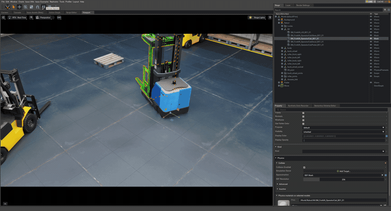
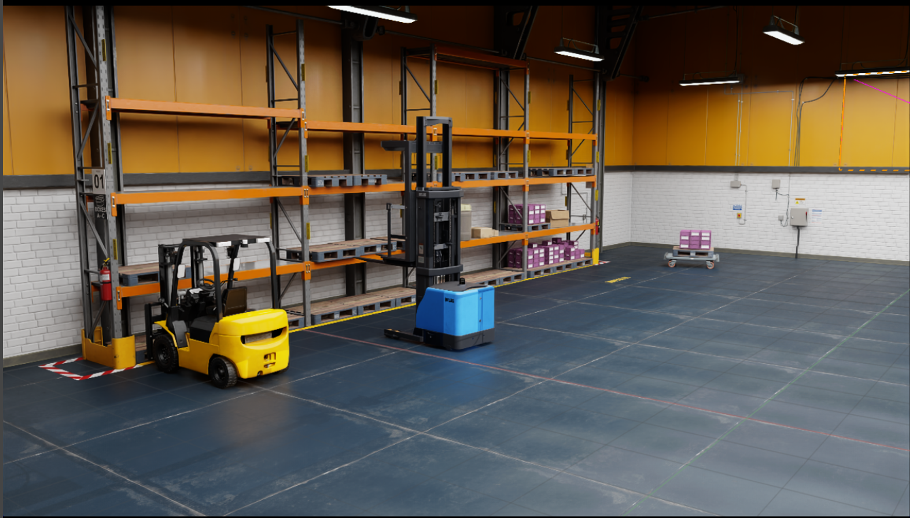
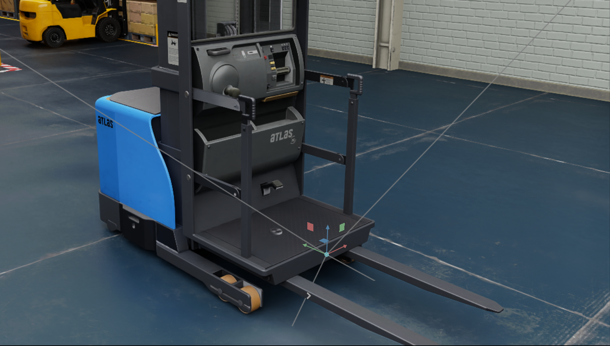
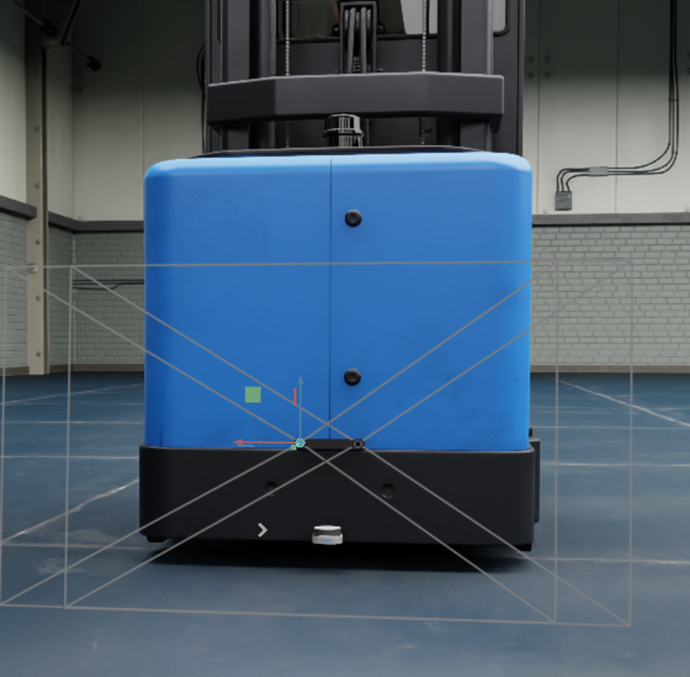
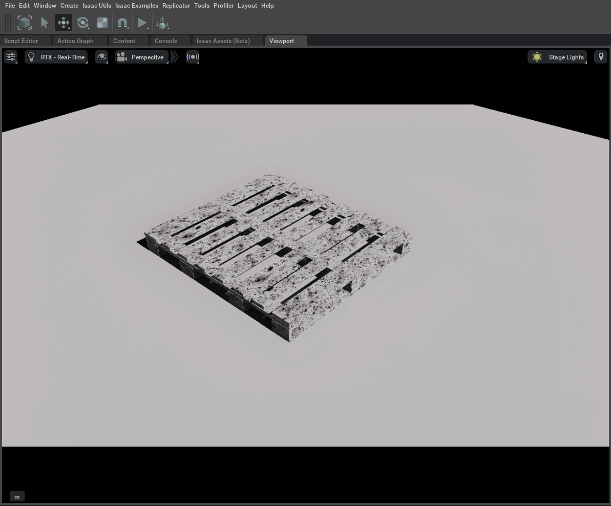
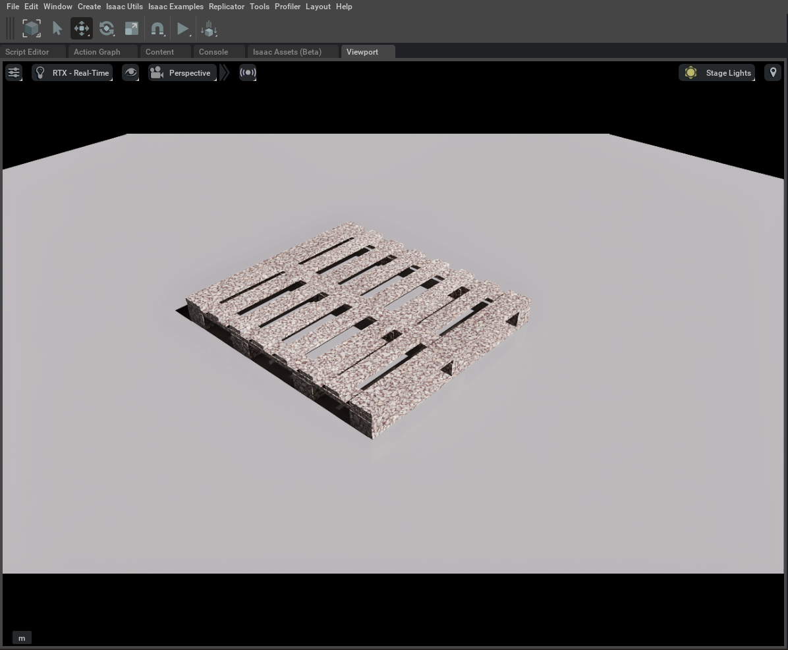
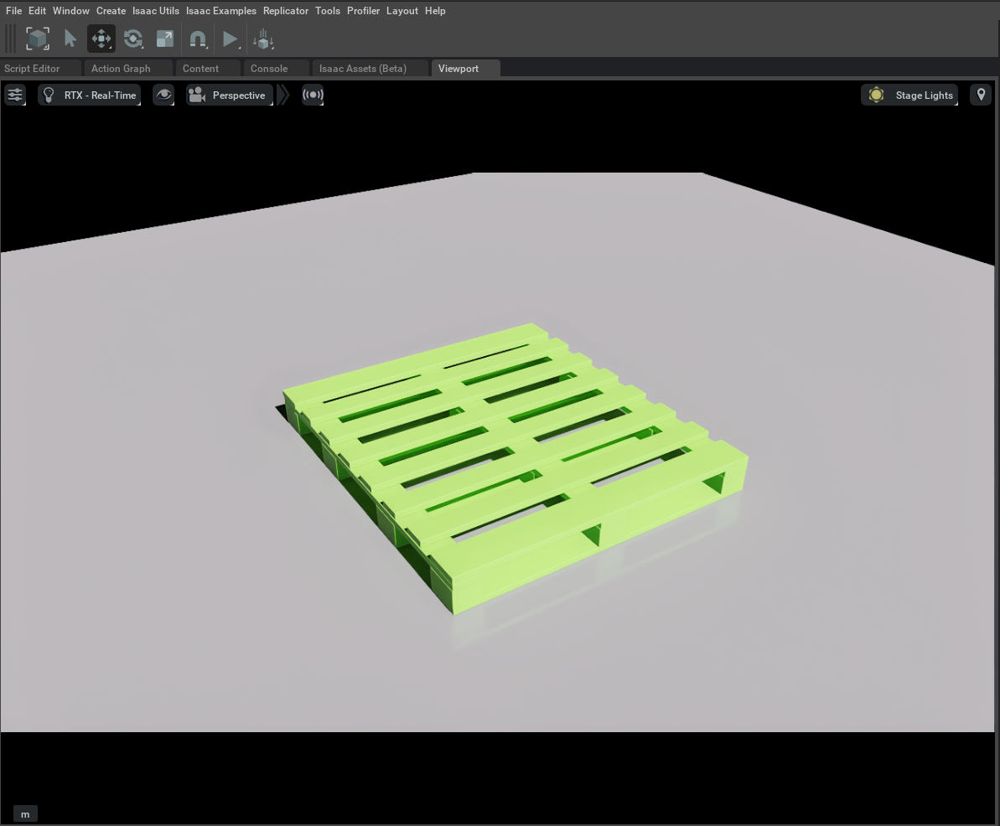
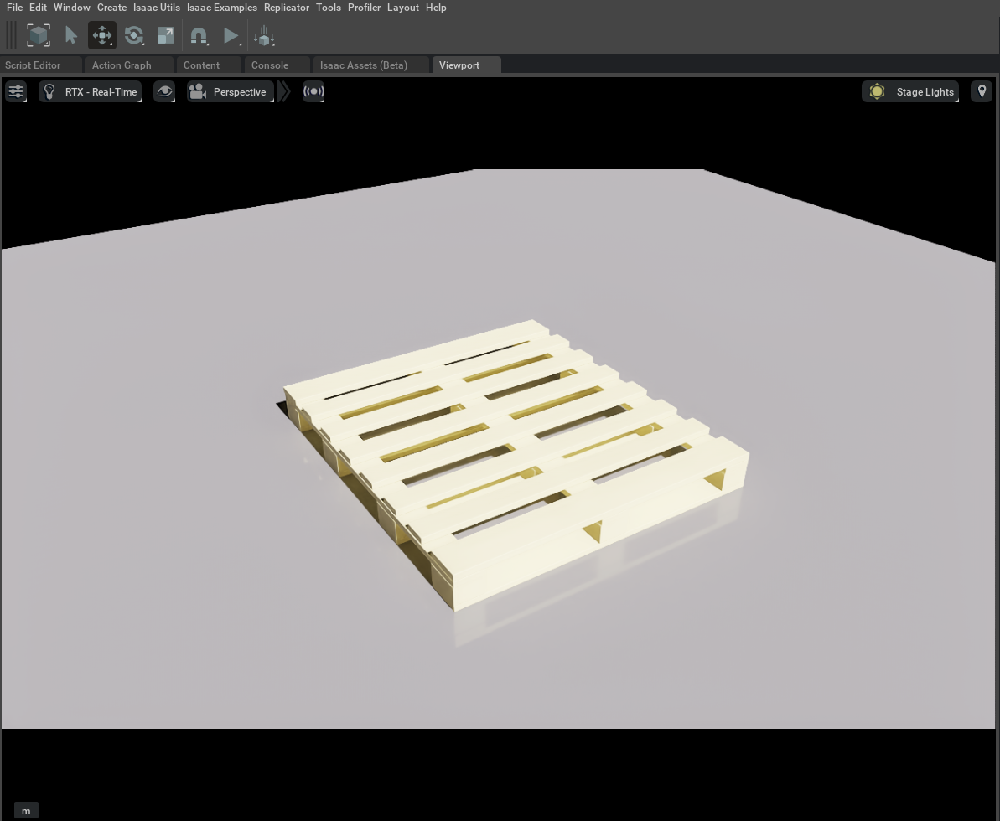

# 🚜 Isaac Sim Autonomous Forklift — Simulation & Pallet Property Handling

> **Undergraduate Research Portfolio**  
> Isaac Sim 기반 무인자율지게차 물류환경 구축 및 Pallet Property Handling 실험 정리

📄 **Paper**: [합성 데이터를 활용한 물류 환경 객체 탐지 모델 학습](https://github.com/happious/isaac-sim-forklift/blob/main/docs/%ED%95%A9%EC%84%B1%20%EB%8D%B0%EC%9D%B4%ED%84%B0%EB%A5%BC%20%ED%99%9C%EC%9A%A9%ED%95%9C%20%EB%AC%BC%EB%A5%98%20%ED%99%98%EA%B2%BD%20%EA%B0%9D%EC%B2%B4%20%ED%83%90%EC%A7%80%20%EB%AA%A8%EB%8D%B8%20%ED%95%99%EC%8A%B5.pdf)  
🏆 **KRoC 2025 · AFCV 우수논문상**

<p align="center">
  
</p>

## 📌 Overview

본 프로젝트는 **Isaac Sim 환경에서 무인자율지게차의 팔레트 인식 및 적재·하역 자동화 시스템을 검증**하기 위한 학부연구 프로젝트입니다.


연구 과정에서 제가 담당한 부분은 다음과 같습니다.

- Isaac Sim 기반 **Warehouse / Forklift / Pallet 환경 구성**
- Forklift **RGB-D Camera 및 Sensor 환경 구성**
- OmniGraph / Script 기반 **Forklift 제어 및 ROS Camera Publish 환경 구성**
- Pallet **색상·재질 Property Handling 실험**
- Synthetic Dataset 생성환경 구성 및 **Dataset Labeling**
- 가상환경 기반 객체탐지 학습·검증을 위한 데이터 구성

> 이 저장소의 `pallet_material_randomizer.py`는 연구 당시 진행했던  
> **Pallet 색상·재질 변경 실험을 포트폴리오용 Standalone 예제로 재구성한 코드**입니다.  
> 당시 전체 연구 코드를 그대로 복원한 저장소는 아닙니다.

---

## 🏭 Isaac Sim Environment

Isaac Sim에서 Warehouse, Forklift, Pallet을 배치하고 센서 및 제어 환경을 구성했습니다.

<p align="center">
  
</p>

### Forklift / Sensor Setup

- Forklift Joint 및 Rigging
- Front / Rear RGB-D Camera 배치
- RGB / Depth ROS Topic Publish
- Keyboard 기반 Forklift 주행 및 Lift 제어

<table>
  <tr>
    <td align="center" width="50%">
      
      <br/>
      <b>Front Sensor Setup</b>
    </td>
    <td align="center" width="50%">
      
      <br/>
      <b>Rear Sensor Setup</b>
    </td>
  </tr>
</table>

---

## 🎨 Pallet Property Handling

Isaac Sim Script Level에서 Pallet의 **색상 및 재질 속성 변경**을 실험했습니다.

<table>
  <tr>
    <td></td>
    <td></td>
  </tr>
  <tr>
    <td></td>
    <td></td>
  </tr>
</table>

### Standalone Demo

`src/pallet_material_randomizer.py`는 외부 Pallet USD 없이도 바로 확인할 수 있도록  
**간단한 Pallet 형상을 코드에서 생성**하고 다음 속성을 주기적으로 Randomize합니다.

- **Base Color**
- **Roughness**
- **Metallic**
- Material preset
  - Painted Matte
  - Painted Smooth
  - Wood-like
  - Plastic
  - Metallic
  - Rough Industrial

실행 후 Pallet의 외관이 일정 프레임마다 자동으로 변경됩니다.

```text
Pallet Geometry
      ↓
USD Preview Surface Material
      ↓
Color Randomization
      ↓
Roughness / Metallic Randomization
      ↓
Real-time Viewport Update
```

---

## ▶️ Run

### Requirements

- NVIDIA Isaac Sim
- Isaac Sim bundled Python

일반 Python이 아니라 **Isaac Sim에 포함된 Python 실행파일**로 실행해야 합니다.

### Linux

```bash
cd isaac-sim-forklift-portfolio
<ISAAC_SIM_ROOT>/python.sh src/pallet_material_randomizer.py
```

예시:

```bash
~/isaacsim/python.sh src/pallet_material_randomizer.py
```

### Windows

```powershell
cd isaac-sim-forklift-portfolio
<ISAAC_SIM_ROOT>\python.bat src\pallet_material_randomizer.py
```

> Isaac Sim 설치 방식/버전에 따라 `python.sh`, `python.bat`의 실제 경로는 달라질 수 있습니다.

실행하면:

1. Isaac Sim GUI 실행
2. Floor / Light / Camera 생성
3. Pallet 자동 생성
4. Pallet 색상 및 Material Property 변경
5. 변경값을 Console에 출력

예시 Console:

```text
[PALLET RANDOMIZED] preset=wood_like | rgb=(0.62, 0.31, 0.14) | roughness=0.71 | metallic=0.01
[PALLET RANDOMIZED] preset=metallic  | rgb=(0.31, 0.42, 0.67) | roughness=0.24 | metallic=0.83
```

---

## 📂 Repository Structure

```text
isaac-sim-forklift-portfolio/
│
├── README.md
├── .gitignore
│
├── src/
│   └── pallet_material_randomizer.py
│
├── legacy/
│   ├── forklift_camera_control.py
│   └── forklift_camera_only.py
│
├── docs/
│   └── 합성 데이터를 활용한 물류 환경 객체 탐지 모델 학습.pdf
│
└── assets/
    ├── warehouse_environment.png
    ├── forklift_sensor_environment.png
    ├── senser_back.png
    ├── pallet_variant_01.png
    ├── pallet_variant_02.png
    ├── pallet_variant_03.png
    └── pallet_variant_04.png
```

### `legacy/`

연구 당시 보존된 Isaac Sim 코드입니다.

- `forklift_camera_only.py`
  - Warehouse / Forklift Asset 구성
  - Front / Rear RGB-D Camera 구성
  - ROS RGB / Depth Topic Publish

- `forklift_camera_control.py`
  - Camera 환경 구성
  - Forklift Keyboard Control
  - Lift Joint Control

> Legacy 코드는 연구 당시 로컬 Asset 경로와 Isaac Sim / ROS 환경에 의존하므로  
> 그대로 실행하기보다 **당시 시스템 구성 참고용**으로 보존했습니다.

---

## 🧪 Research Flow

```text
Isaac Sim Warehouse
        ↓
Forklift / Pallet / Sensor Setup
        ↓
Camera RGB / Depth Data
        ↓
Pallet Property Handling
        ↓
Synthetic Data Environment
        ↓
Dataset Labeling
        ↓
Object Detection Training / Evaluation
```

---

## 📄 Paper & Award

- KRoC 2025 논문 발표
- AFCV 우수논문상 수상
- [논문 보기](https://github.com/happious/isaac-sim-forklift/blob/main/docs/%ED%95%A9%EC%84%B1%20%EB%8D%B0%EC%9D%B4%ED%84%B0%EB%A5%BC%20%ED%99%9C%EC%9A%A9%ED%95%9C%20%EB%AC%BC%EB%A5%98%20%ED%99%98%EA%B2%BD%20%EA%B0%9D%EC%B2%B4%20%ED%83%90%EC%A7%80%20%EB%AA%A8%EB%8D%B8%20%ED%95%99%EC%8A%B5.pdf)

## 🛠 Tech Stack

| Category | Technology |
|---|---|
| Simulation | NVIDIA Isaac Sim, Omniverse |
| Robot SW | ROS, Python |
| Synthetic Data | Isaac Sim / Replicator |
| Vision | RGB-D Camera, Object Detection |
| Robot | Autonomous Forklift |
| Sensor | RGB-D Camera, LiDAR |
| Data | Synthetic Dataset, Annotation / Labeling |

---

## 📝 Note

본 저장소는 학부연구 과정에서 수행한 **Isaac Sim 환경 구축 및 Pallet Property Handling 담당 내용을 중심으로 정리한 포트폴리오**입니다.

Standalone Randomizer는 당시 실험 내용을 쉽게 재현할 수 있도록 새로 정리한 예제이며,  
연구 당시 사용된 전체 Synthetic Dataset 생성 파이프라인을 그대로 주장하거나 복원한 코드는 아닙니다.
